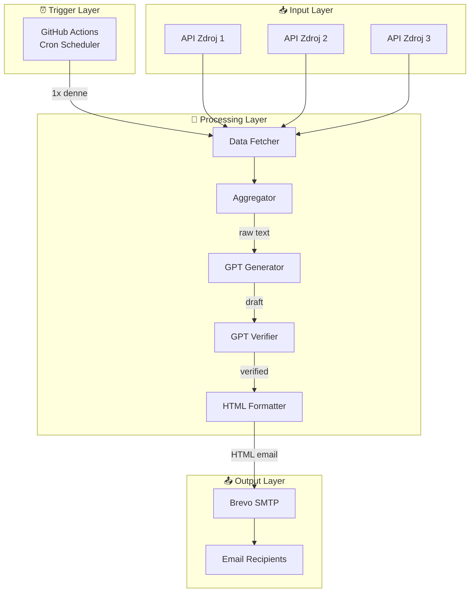
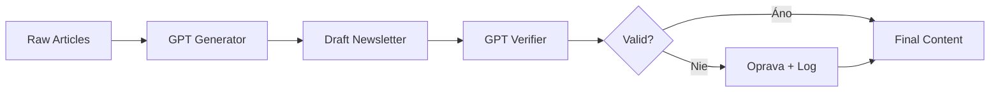
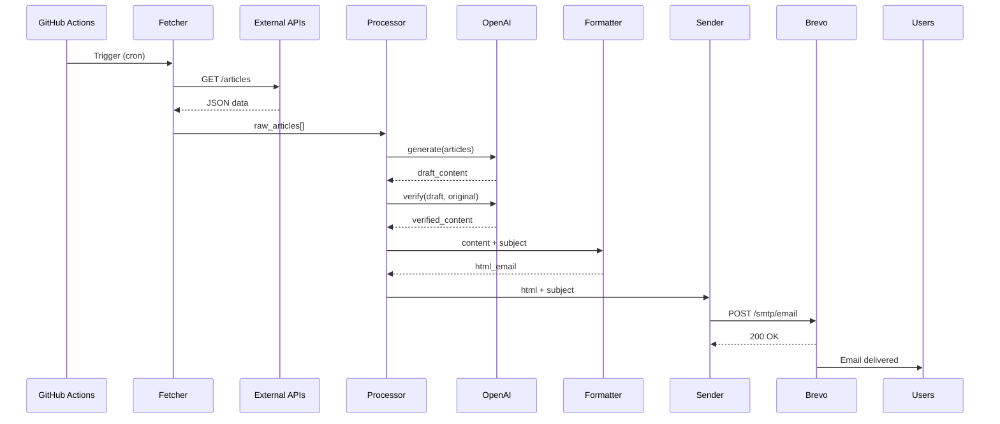

# Investiční Bohovia Newsletter - Architektúra systému

> **Verzia:** 1.0 Draft  
> **Dátum:** 10.1.2026

---

## 1. High-Level Architecture



---

## 2. Štruktúra repozitára

```
IB-newsletter/
├── .github/
│   └── workflows/
│       └── newsletter.yml        # GitHub Actions cron job
├── src/
│   ├── __init__.py
│   ├── main.py                   # Entry point
│   ├── fetcher.py                # API/RSS data fetching
│   ├── processor.py              # GPT integration (gen + verify)
│   ├── formatter.py              # HTML template rendering
│   └── sender.py                 # Brevo email sending
├── templates/
│   └── email_template.html       # HTML email šablóna
├── config/
│   ├── prompts.py                # GPT prompty (generator, verifier)
│   └── settings.py               # Konfigurácia (časy, limity)
├── tests/
│   ├── test_fetcher.py
│   ├── test_processor.py
│   └── test_sender.py
├── specification/
│   ├── sp.md                     # Pôvodná špecifikácia
│   ├── project_plan.md           # Projektový plán
│   └── architecture.md           # Tento dokument
├── .agent/
│   └── agent-rules.md            # Pravidlá pre AI agenta
├── requirements.txt              # Python dependencies
├── .env.example                  # Vzor environment variables
└── README.md                     # Dokumentácia projektu
```

---

## 3. Moduly - Detailný popis

### 3.1 Fetcher (`fetcher.py`)

**Zodpovednosť:** Získanie raw dát z externých zdrojov

```python
# Pseudokód
class DataFetcher:
    def fetch_all_sources() -> list[Article]:
        """Paralelne stiahne dáta zo všetkých zdrojov"""
        
    def fetch_source(url: str) -> Article | None:
        """Stiahne dáta z jedného zdroja s error handling"""
```

| Vstup | Výstup |
|-------|--------|
| 3x API/RSS URL | List článkov (title, content, date, source) |

**Error handling:**
- Timeout: 10 sekúnd per zdroj
- Retry: 1x pri zlyhaní
- Fallback: Ak 1-2 zdroje zlyhajú, pokračuje s dostupnými

---

### 3.2 Processor (`processor.py`)

**Zodpovednosť:** AI spracovanie obsahu



#### GPT Volanie #1: Generator
| Parameter | Hodnota |
|-----------|---------|
| Model | gpt-4o-mini |
| Max tokens | ~500 |
| Temperature | 0.7 |
| Úloha | Sumarizácia, deduplikácia, Tone of Voice |

#### GPT Volanie #2: Verifier
| Parameter | Hodnota |
|-----------|---------|
| Model | gpt-4o-mini |
| Max tokens | ~200 |
| Temperature | 0.2 (nízka pre presnosť) |
| Úloha | Fact-check vs. vstupné dáta |

> [!NOTE]
> **Testovanie temperature:** Hodnoty 0.7 a 0.2 sú starting point. Pri testovaní môžeme upraviť:
> - Texty príliš "suché" → zvýšiť Generator na 0.8
> - Texty príliš "divné" → znížiť Generator na 0.5

---

### 3.3 Formatter (`formatter.py`)

**Zodpovednosť:** Renderovanie HTML emailu

```python
# Pseudokód
def render_email(content: str, subject: str) -> str:
    """Vloží obsah do HTML šablóny"""
```

---

## 4. Email Template - Detailná špecifikácia

### 4.1 Štruktúra newslettera

```
┌─────────────────────────────────────────────────────────────┐
│                     HEADER                                   │
│  ┌─────────────────────────────────────────────────────┐    │
│  │  [LOGO: Investiční Bohovia]                         │    │
│  │  Denný crypto prehľad • 10.1.2026                   │    │
│  └─────────────────────────────────────────────────────┘    │
├─────────────────────────────────────────────────────────────┤
│                     HLAVNÝ OBSAH                             │
│                                                              │
│  🔥 HLAVNÁ SPRÁVA DŇA                                       │
│  ─────────────────────                                       │
│  Bitcoin prelomil $100,000 - čo to znamená pre trh?         │
│  [AI generovaný text o hlavnej správe...]                   │
│                                                              │
│  📰 V SKRATKE                                                │
│  ─────────────                                               │
│  • Ethereum zaznamenal 5% rast za posledných 24h            │
│  • Solana spúšťa nový upgrade siete                         │
│  • Binance oznámil nové trading páry                        │
│                                                              │
├─────────────────────────────────────────────────────────────┤
│                     CTA BUTTON                               │
│           ┌─────────────────────────────┐                    │
│           │    📱 Pridaj sa na Discord   │  ← Voliteľné     │
│           └─────────────────────────────┘                    │
├─────────────────────────────────────────────────────────────┤
│                     PÄTIČKA                                  │
│  © 2026 Investiční Bohovia                                  │
│  [Odhlásiť sa z odberu] ← Automaticky cez Brevo             │
└─────────────────────────────────────────────────────────────┘
```

### 4.2 Technické požiadavky na template

| Požiadavka | Hodnota | Dôvod |
|------------|---------|-------|
| **Max šírka** | 600px | Optimálne pre desktop aj mobil |
| **Fonty** | Arial, Verdana (web-safe) | Fungujú vo všetkých klientoch |
| **Min font size** | 14-16px | Čitateľné na mobile |
| **Layout** | Table-based | Outlook nepodporuje flexbox |
| **CSS** | Inline | Outlook ignoruje `<style>` tagy |
| **Veľkosť emailu** | < 100KB | Gmail oreže väčšie emaily |
| **Text:Obrázky** | 80:20 | Vyhnutie sa spam filtrom |

### 4.3 CTA Button špecifikácia

```html
<!-- Príklad CTA buttonu (email-safe) -->
<table border="0" cellpadding="0" cellspacing="0">
  <tr>
    <td align="center" bgcolor="#6366F1" style="border-radius: 8px;">
      <a href="https://discord.gg/investicnibohovia" 
         target="_blank" 
         style="display: inline-block; 
                padding: 14px 28px; 
                font-family: Arial, sans-serif; 
                font-size: 16px; 
                color: #ffffff; 
                text-decoration: none;">
        📱 Pridaj sa na Discord
      </a>
    </td>
  </tr>
</table>
```

| Parameter | Odporúčanie |
|-----------|-------------|
| **Veľkosť** | Min 46×46px (mobile-friendly) |
| **Farba** | Kontrastná voči pozadiu |
| **Text** | Akčný ("Pridaj sa", "Čítaj viac") |
| **Umiestnenie** | Po hlavnom obsahu, pred pätičkou |

### 4.4 Responzívny dizajn

```html
<!-- Media query pre mobily -->
@media screen and (max-width: 600px) {
  .email-container { width: 100% !important; }
  .content-padding { padding: 20px 15px !important; }
  .mobile-stack { display: block !important; width: 100% !important; }
}
```

> [!NOTE]
> Niektorí email klienti (Outlook) nepodporujú media queries. 
> Template musí vyzerať dobre aj bez nich (mobile-first prístup).

### 4.5 Dark Mode kompatibilita

| Element | Light Mode | Dark Mode |
|---------|------------|-----------|
| Pozadie | #FFFFFF | Automaticky invertované |
| Text | #1F2937 | Automaticky invertované |
| Logo | Svetlá verzia | Potrebná tmavá verzia (ak obrázok) |

> [!TIP]
> Pre dark mode je najlepšie používať textové logo namiesto obrázka.

---

### 3.4 Sender (`sender.py`)

**Zodpovednosť:** Odoslanie cez Brevo API

```python
# Pseudokód
def send_newsletter(html: str, subject: str) -> bool:
    """Odošle email na všetkých odberateľov cez Brevo"""
```

| Feature | Implementácia |
|---------|---------------|
| SMTP | Brevo Transactional API |
| Recipients | Brevo contact list (nie hardcoded) |
| Tracking | Brevo dashboard |
| Unsubscribe | Automaticky cez Brevo |

---

## 4. Data Flow - Kompletný tok



---

## 5. Konfigurácia a Secrets

### Environment Variables (GitHub Secrets)

| Secret | Popis |
|--------|-------|
| `OPENAI_API_KEY` | API kľúč pre GPT |
| `BREVO_API_KEY` | API kľúč pre Brevo SMTP |
| `BREVO_SENDER_EMAIL` | Odosielateľ (napr. newsletter@investicnibohovia.sk) |
| `BREVO_LIST_ID` | ID contact listu v Brevo |

### Config Settings (`config/settings.py`)

```python
# Príklad konfigurácie
NEWSLETTER_CONFIG = {
    "send_time": "07:00",          # CET
    "max_words": 350,
    "min_words": 250,
    "api_sources": [
        {"name": "Source1", "url": "...", "type": "api"},
        {"name": "Source2", "url": "...", "type": "rss"},
        {"name": "Source3", "url": "...", "type": "api"},
    ],
    "subject_prefix": "Crypto Daily |",
}
```

---

## 6. GitHub Actions Workflow

```yaml
# .github/workflows/newsletter.yml
name: Daily Newsletter

on:
  schedule:
    - cron: '0 6 * * *'  # 06:00 UTC = 07:00 CET
  workflow_dispatch:      # Manuálny trigger

jobs:
  send-newsletter:
    runs-on: ubuntu-latest
    steps:
      - uses: actions/checkout@v4
      
      - name: Setup Python
        uses: actions/setup-python@v5
        with:
          python-version: '3.11'
          
      - name: Install dependencies
        run: pip install -r requirements.txt
        
      - name: Run newsletter pipeline
        env:
          OPENAI_API_KEY: ${{ secrets.OPENAI_API_KEY }}
          BREVO_API_KEY: ${{ secrets.BREVO_API_KEY }}
        run: python src/main.py
```

---

## 7. Failover a Resiliencia

| Scenár | Riešenie |
|--------|----------|
| 1 API zdroj nefunguje | Pokračuj s 2 zdrojmi |
| 2 API zdroje nefungujú | Pokračuj s 1 zdrojom + varovanie v logu |
| Všetky API zlyhajú | Neodošli newsletter + notifikuj admina |
| GPT timeout | Retry 1x, potom fallback na jednoduchý formát |
| Brevo zlyhá | Log error, retry v ďalšom cykle |

---

## 8. Rozšíriteľnosť (budúcnosť)

| Feature | Náročnosť | Poznámka |
|---------|-----------|----------|
| Viac API zdrojov | Nízka | Len pridať do config |
| Personalizácia mena | Nízka | Brevo template variables |
| A/B testing subject | Stredná | Brevo natívna podpora |
| Archivácia na webe | Stredná | Uložiť HTML do GitHub Pages |
| Viac jazykov (CZ) | Stredná | Paralelný prompt |

zlavy/sutaze na discord pre subscriberov.
